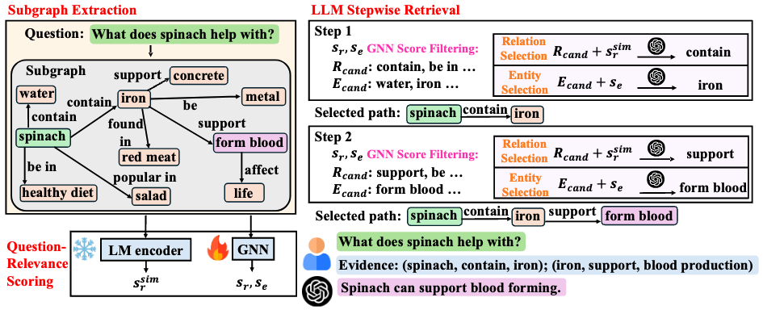

# Knowledge Graph Retrieval-Augmented Generation via GNN-Guided Prompting

The codes are associated with the following paper:

>**Knowledge Graph Retrieval-Augmented Generation via GNN-Guided Prompting**

## 1. Datasets

This project uses the dataset provided by [GNN-RAG](https://drive.google.com/drive/folders/1ifgVHQDnvFEunP9hmVYT07Y3rvcpIfQp). While using a different entity-name file (`scripts/entities_names_all.json` for webqsp and `scripts/entities_names_all2.json` for CWQ)

Please refer to their official repository or paper for more details and citation information.

Unzip the folder `data` under `./scripts/`.

## 2. Dependencies

Run the following commands to create a conda environment:

    conda create -y -n ggr python=3.11
    conda activate ggr
    pip install numpy==2.0.1
    pip install torch==2.4.0
    pip install transformers==4.46.2
    pip install tqdm
    pip install scikit-learn==1.5.1
    pip install openai
    pip install anthropic

Write your own OpenAI API key and Anthropic API key in the first few lines of `./scripts/train_model`.

## 3. Setting up the Entity and Relation Embeddings

Run

    cd scripts
    python set-embs --dataset webqsp
    python set-embs --dataset CWQ

## 4. Training

To train our GNN model on two dataset:

For the Webqsp dataset on gpt3.5, run

    python train.py --name webqsp --data_folder data/webqsp/ --llm_name gpt3.5

For the Webqsp dataset on gpt4-mini, run

    python train.py --name webqsp --data_folder data/webqsp/ --llm_name gpt4

For the Webqsp dataset on claude-3-haiku, run

    python train.py --name webqsp --data_folder data/webqsp/ --llm_name Claude

For the CWQ dataset on gpt3.5, run

    python train.py --name CWQ --data_folder data/webqsp/ --llm_name gpt3.5

For the CWQ dataset on gpt4-mini, run

    python train.py --name CWQ --data_folder data/webqsp/ --llm_name gpt4

For the CWQ dataset on claude-3-haiku, run

    python train.py --name CWQ --data_folder data/webqsp/ --llm_name Claude

## 5. Evaluating

To evaluate the model on dataset:

For the Webqsp dataset on gpt3.5, run

    python test.py --name webqsp --data_folder data/webqsp/ --llm_name gpt3.5

For the Webqsp dataset on gpt4-mini, run

    python test.py --name webqsp --data_folder data/webqsp/ --llm_name gpt4

For the Webqsp dataset on claude-3-haiku, run

    python test.py --name webqsp --data_folder data/webqsp/ --llm_name Claude

For the CWQ dataset on gpt3.5, run

    python test.py --name CWQ --data_folder data/webqsp/ --llm_name gpt3.5

For the CWQ dataset on gpt4-mini, run

    python test.py --name CWQ --data_folder data/webqsp/ --llm_name gpt4

For the CWQ dataset on claude-3-haiku, run

    python test.py --name CWQ --data_folder data/webqsp/ --llm_name Claude
